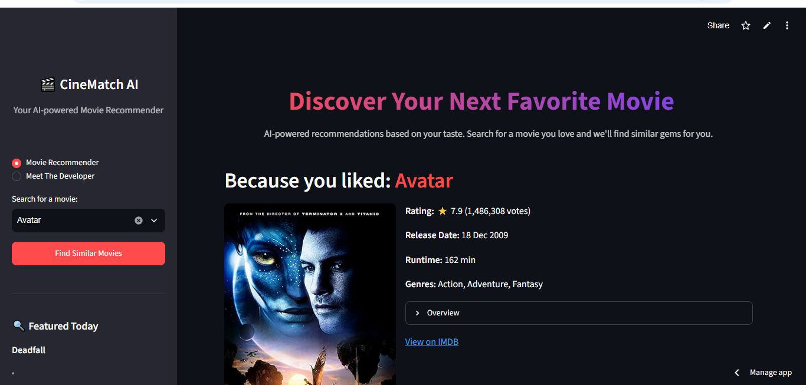
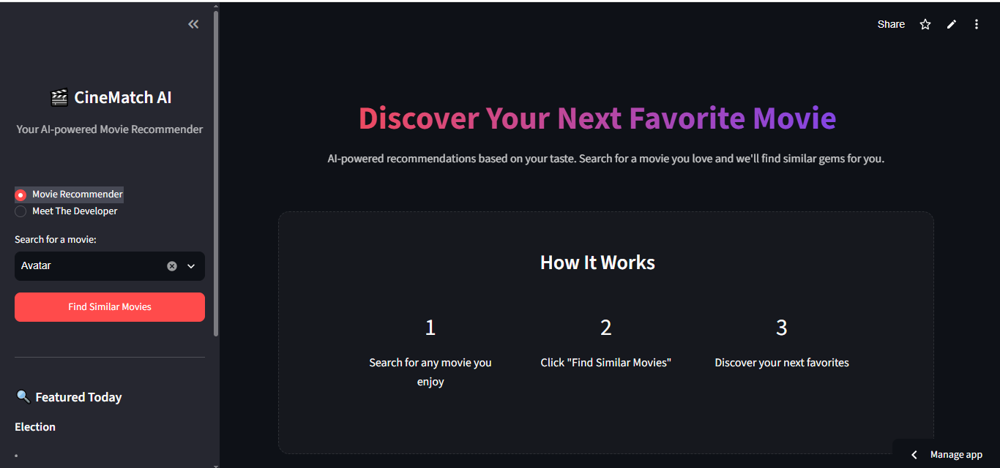
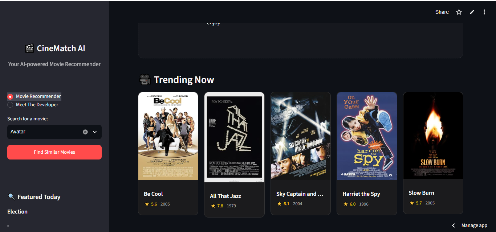
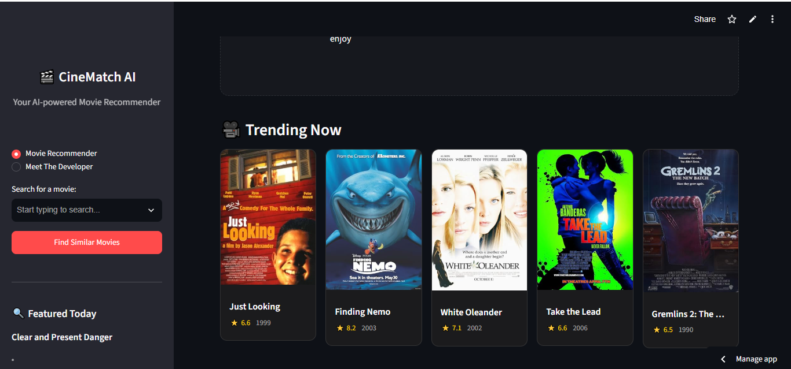
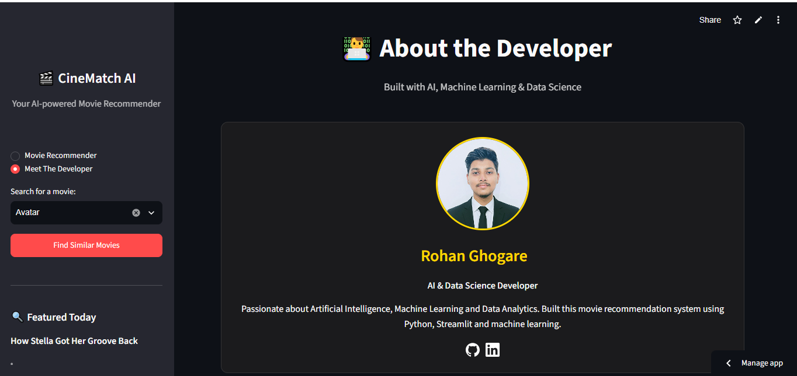

# 🎬 AI-Powered Movie Recommendation Engine

[](https://streamlit.io/)
[](https://python.org)
[](https://opensource.org/licenses/MIT)

> ⚡ Stop wasting time deciding what to watch.
> Let AI recommend your next favorite movie in seconds — no user history required.

---

## 🔗 Live Demo

🚀 **[Try the Movie Recommendation Engine](https://movierecommendation-a.streamlit.app/)**

---

## 📸 Project Preview

### 🎬 Movie Recommendation

<p align="center">
  
</p>

### ⚙️ How It Works

<p align="center">
  
</p>

### 🔥 Trending Movies

<p align="center">
  
</p>

<p align="center">
  
</p>

### 👨‍💻 About the Developer

<p align="center">
  
</p>

---ss

## ✨ Features

* 🎯 **Content-Based Recommendations** — Recommends movies based on similarity between movie features.
* ⚡ **Fast Recommendations** — Get movie recommendations within seconds.
* 🔍 **Simple Search** — Enter a movie you like and discover similar movies.
* 🎬 **Movie Details** — Displays movie information, ratings, and posters.
* 🔒 **Privacy Friendly** — No personal user history is required.
* 📦 **Fallback Support** — Built-in fallback helps the application continue working when live movie data is unavailable.
* 📱 **Interactive UI** — Simple and user-friendly Streamlit interface.

---

## 🛠️ Tech Stack

| Component             | Technology        | Purpose                              |
| --------------------- | ----------------- | ------------------------------------ |
| Programming Language  | Python            | Application development              |
| Recommendation Engine | Scikit-learn      | Similarity-based recommendations     |
| Similarity Algorithm  | Cosine Similarity | Finds similar movies                 |
| Data Processing       | Pandas            | Data cleaning and processing         |
| Frontend              | Streamlit         | Interactive web interface            |
| Movie Data            | OMDb API          | Movie details, posters and ratings   |
| Model/Data Storage    | Pickle            | Stores processed recommendation data |

---

## 🤖 How It Works

The application uses a **content-based recommendation system**.

### Step 1 — Select a Movie

The user enters or selects a movie they like.

### Step 2 — Feature Processing

Movie information such as genres, keywords, storyline-related information and other metadata are processed.

### Step 3 — Similarity Calculation

The system uses **Cosine Similarity** to calculate how similar other movies are to the selected movie.

### Step 4 — Recommendations

The application returns a list of movies that are most similar to the selected movie.

### Step 5 — Movie Information

The application displays relevant movie information such as posters, ratings and other available details.

---

## 🧠 Recommendation Approach

This project uses **content-based filtering** rather than collaborative filtering.

The recommendation engine compares movie features and calculates their similarity.

The basic workflow is:

```text
Movie Selection
       ↓
Movie Features
       ↓
Feature Vectorization
       ↓
Cosine Similarity
       ↓
Similar Movies
       ↓
Movie Details & Posters
```

---

## ⚙️ Installation & Setup

### 1. Clone the Repository

```bash
git clone https://github.com/rohanghogare2509-beep/MovieRecommendation.git
```

### 2. Move Into the Project Folder

```bash
cd MovieRecommendation
```

### 3. Create a Virtual Environment

```bash
python -m venv .venv
```

### 4. Activate the Virtual Environment

#### Windows

```bash
.venv\Scripts\activate
```

#### macOS / Linux

```bash
source .venv/bin/activate
```

### 5. Install Dependencies

```bash
pip install -r requirements.txt
```

### 6. Run the Application

```bash
streamlit run app.py
```

The application will open in your browser.

---

## 🔑 API Configuration

This project uses the **OMDb API** to retrieve movie details, posters and ratings.

For local development, configure your API key using Streamlit secrets.

Create:

```text
.streamlit/secrets.toml
```

Then add:

```toml
OMDB_API_KEY = "your_api_key_here"
```

⚠️ **Never upload your API key or `secrets.toml` file to GitHub.**

---

## 📂 Project Structure

```text
MovieRecommendation/
│
├── app.py
├── requirements.txt
├── README.md
│
├── photos/
│   ├── 1d6dde0cda644f0a89d30547fa44410a.jpg
│   └── 275de601ea244f8aa2d3f91b18f5367e.jpg
│
├── .streamlit/
│   └── secrets.toml
│
└── similarity.pkl
```

---

## 🎯 Example

For example, if the user selects:

```text
Inception
```

The recommendation engine analyzes the movie's available features and returns movies with similar characteristics.

The recommendations can include movies related to:

* Science Fiction
* Thriller
* Mystery
* Action
* Psychological themes

---

## 🚀 Future Improvements

Some possible improvements for this project include:

* 🤝 Add collaborative filtering
* ⭐ Add user ratings
* 👤 Add personalized user profiles
* 🌐 Add support for Hindi and Marathi movies
* 🎨 Improve the Streamlit UI
* 🌙 Add dark/light mode
* 📊 Add movie analytics
* 🔎 Improve movie search
* 🎬 Add more movie metadata
* 🤖 Experiment with advanced recommendation models

---

## 🤝 Contributing

Contributions are welcome!

You can:

1. Fork the repository
2. Create a new branch
3. Make your changes
4. Commit your changes
5. Open a Pull Request

```bash
git checkout -b feature/new-feature
git add .
git commit -m "Add new feature"
git push origin feature/new-feature
```

---

## 📜 License

This project is licensed under the **MIT License**.

You are free to use, modify and distribute this project according to the terms of the license.

---

## 👨‍💻 About the Developer

### Rohan Ghogare

**AI & Data Science Graduate | Machine Learning | Generative AI | Python**

I am an AI & Data Science graduate interested in **Machine Learning, Data Science, Generative AI, NLP and Python development**.

This project demonstrates my practical experience in building a **content-based movie recommendation system using Python, Scikit-learn, Pandas, Cosine Similarity and Streamlit**.

### Connect With Me

📧 **Email:** [rohanhgogare2509@gmail.com](mailto:rohanhgogare2509@gmail.com)

💼 **LinkedIn:** [Rohan Ghogare](https://www.linkedin.com/in/rohan-ghogare/)

💻 **GitHub:** [rohanghogare2509-beep](https://github.com/rohanghogare2509-beep)

---

## ⭐ Support

If you found this project useful, consider giving the repository a ⭐ on GitHub.

---

> 🎬 Built with Python, Machine Learning and Streamlit by **Rohan Ghogare**.